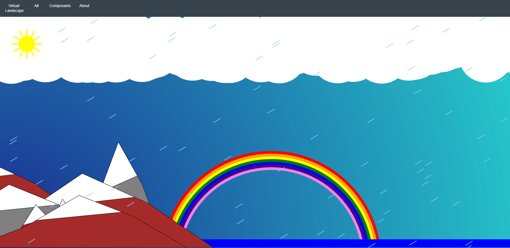

## Générateur de paysages virtuels 

Cette application génère, à chaque fois qu'elle est activée (ou rechargée), un paysage imaginaire, construit avec du code JavaScript.

C'est un projet de développement logiciel à destinatation d'apprentis développeur.

### Prérequis 

* Connaissance de base de HTML / CSS (le JS peut être abordé ici pour la première fois)

* Connaissance de base en programmation 

* Connaissance de base en POO (_programmation orientée objet_)

* git de base + IDE (visual studio code, intelliJ, ou autre)

### Objectifs  

* Apprendre à prendre en main un existant : petite application javascript (sans framework)
* Apprendre à programmer en javascript dans une approche objet et événementielle
* Aborder une nouvelle technolgie en mode autodidacte (utilisation de l'API 2D JS intégrée)
* Développer sa créativité  

Exemples de travaux étudiants (copies écran) :
<p float="left">


</p>

## I/ Comprendre le canvas HTML

1. Étudier le tutoriel https://developer.mozilla.org/fr/docs/Tutoriel_canvas/Utilisation_de_base - pour un internet ouvert - Fondation Mozilla open source (https://www.mozilla.org/fr/about/manifesto/)


## II/ Travaux pratiques

2. Reprendre le canvas de base du tutoriel: [Canvas Basic Usage](https://developer.mozilla.org/fr/docs/Web/API/Canvas_API/Tutorial/Basic_usage)

```html

<!DOCTYPE html>
<html>
<head>
  <meta charset="utf-8"/>
  <script type="application/javascript">
    function draw() {
      var canvas = document.getElementById("canvas");
      if (canvas.getContext) {
        var ctx = canvas.getContext("2d");

        ctx.fillStyle = 'rgb(200, 0, 0)';
        ctx.fillRect(10, 10, 50, 50);

        ctx.fillStyle = 'rgba(0, 0, 200, 0.5)';
        ctx.fillRect(30, 30, 50, 50);
      }
    }
  </script>
</head>
<body onload="draw();">
<canvas id="canvas" width="150" height="150"></canvas>
</body>
</html>
```
Aller ensuite sur la page suivante du tutoriel : https://developer.mozilla.org/fr/docs/Web/API/Canvas_API/Tutorial/Drawing_shapes#d%C3%A9placement_du_stylo

Le tutoriel vous donne le code de cette forme :


Vous êtes invité à consulter le mode d'emploi de la fonction `arc` ici (en français) : 
https://developer.mozilla.org/fr/docs/Web/API/CanvasRenderingContext2D/arc


Voici le code de ce smiley, placé dans une fonction nommée `smiley` et appelé dans la fonction `draw`.


```html
<!DOCTYPE html>
<html>

<head>
<meta charset="utf-8" />

<script type="application/javascript">
function draw() {
    const canvas = document.getElementById('canvas');
    if (canvas.getContext) {
        const ctx = canvas.getContext('2d');

        // appel la fonction (positionnement en y en 100)
        smiley(ctx, 0, 100)

        console.log('hauteur max ' + window.innerWidth)
        console.log('largeur max ' + window.innerWidth)
    }
}

function smiley(ctx, dx, dy) {
    let ox = dx
    let oy = dy
   
    ctx.save()

    ctx.beginPath();
    ctx.arc(ox + 50, oy + 50, 50, 0, Math.PI * 2, true);  // Cercle extérieur
    ctx.moveTo(ox + 85, oy + 50);
    ctx.arc(ox + 50, oy + 50, 35, 0, Math.PI, false);  // Bouche (sens horaire)
    ctx.moveTo(ox + 40, oy + 40);
    ctx.arc(ox + 35, oy + 40, 5, 0, Math.PI * 2, true);  // Oeil gauche
    ctx.moveTo(ox + 70, oy + 40);
    ctx.arc(ox + 65, oy + 40, 5, 0, Math.PI * 2, true);  // Oeil droite
    ctx.stroke();

    // restores the styles from earlier
    // preventing the colors used here
    // from polluting other drawings
    ctx.restore()
}
</script>

</head>

<body onload="draw();">
   <canvas id="canvas" width="100%" height="100%"></canvas>
</body>

</html>

```
 
**2.1.** Votre premier travail consiste à **peindre les yeux de ce smiley en une couleur de votre choix**

**2.2.** Concevoir **2 autres expressions type smileys de votre choix - avec des couleurs**, sur la base de celle donnée. (temps estimé 2h à 3h). Vous chercherez à conserver l'esthétique initiale (à garder le même thème sur l'ensemble de votre création) 

## III/ Présentation de l'application

À ce niveau là, vous avez acquis une certaine expérience dans le dessin vectoriel via l'API 2D. 

Nous allons maintenant découvrir l'application JS support, afin de la faire évouler.

### Prise en main

Télécharger l'application dans un **dossier dédié**.

### Accessible via un serveur HTTP

Attention, l'application doit être placée derrière en serveur HTTP, et donc accessible à un utilisateur en réponse à une requête `HTTP`, commençant par `http://` (et non en protocole `file://`)

Sous VS, vous pouvez installer l'extension `Live Server`. Une fois installée, vous pouvez faire clic droit sur `index.html` pour lancer une instance d'un serveur HTTP, sur un port particulier, de votre machine locale. Ainsi votre application est-elle prête à être testée.


Tester l'application en actionnant ses différents commandes dans ses menus.

L'application est livrée avec des formes de base qu'il faudra retirer (sauf `Immeuble` si vous souhaitez l'améliorer, en ajoutant aléatoirement des fenêtres éclairées par exemple, ou autres...)

### Arborescence des dossiers

L'application utilse **Vanilla JS framework**. 

La structure des dossiers est relativement simple.

```
.
├── css
│   ├── layout.css
│   └── menu.css
├── docs
│   ├── analyse.dia
│   ├── analyse.png
│   └── ...
├── js
│   ├── main.js
│   └── modules
│       ├── index.js
│       ├── AbstractForm.js
│       ├── Immeuble.js
│       ├── Triangle.js
│       └── ...
├── README.md
└── index.html
```

* `index.html` : Point d'entrée de l'interprétation par un navigateur. Les dépendances de ce fichier sont les feuiiles de styles `css`, et l'inclusion du script `js/main.js`.

* `main.js` : Le chef d'orchestre. Le code qui pilote les actions de dessins. Ce code exploite les classes déclarées dans `js/modules` qui héritent de `AbstractForm`. 

* le dossier `js/modules` contient le code source de classes javascript chargées de dessinner des formes. **C'est dans ce dossier que vous placerez vos classes représentant les formes issues de votre imagination**. 

* `js/modues/index.js` : Déclare les classes des formes (à mettre à jour lorsque vous définissez une nouvelle classe)
* `js/modues/AbstractForm.js` : c'est la classe de base des formes à venir (des exemples sont fournies)
* `js/modues/Immeuble.js`, `Planete.js`  et `Triangle.js` sont des exemples.

En résumé : Conformément aux exemples fournis, vos nouvelles formes seront représentées par des classes héritant de `AbstractForm.js` et placées dans le dossier `modules`, et déclarées dans `modules/index.js`. 
 
 


### Classe de forme

Ces classes sont spécialisées dans une forme donnée, comme dans les exemples.

Une classe de forme hérite de `AbstractForm` (ses attributs sont présentés plus loin) :

```javascript

import { AbstractForm } from './AbstractForm.js';

/**
 * Déssine un ?????
 */
export class ????? extends AbstractForm {
   constructor (
    x = 0,
    y = 0,
    width = 0,
    height = 0,
    fillColor = '',
    strokeColor = '',
    strokeWidth = 2,
    pesenteur = false,
    odreConstruction = 100
  ) {
    super(x,y,width, height, fillColor, strokeColor, strokeWidth, pesenteur, odreConstruction)
  }

 /**
   * Dessine la forme spécifique à cette classe
   * @param ctx contexte 2D du canvas
   */
  draw (ctx) {
    super.draw(ctx) 
       // pour prise en compte de la pesanteur (redefinit y)

    ctx.save()

    // votre code ici

    ctx.restore()
  }

 /**
   * get array of instances of this class
   * @return {[Object,...]}
   */
  static buildForms() {
    let forms = []


    // votre code ici


    return forms
  }

```

La méthode `draw` est une **méthode d'instance** qui prend en charge la logique de dessin d'une forme primitive à partir d'un _context 2D_ reçu en paramètre.

La méthode `buildForms` est une **méthode de classe** qui prend en charge la construction d'un motif, composé **d'instances la classe** afin de produire un réultat **avec une dose d'aléatoire**. Par exemple, construction de plusieurs instances de la classe `Triangle` disposées aléatroirement. 
**Cette méthode retourne un tableau d'instances de la classe.**

### Attributs d'une forme (à renseigner lors d'une instanciation)

- `x = 0`  coordonnées en x et y du dessin dans son canvas
- `y = 0`
- `width = 0`   largeur et hauteur de la zone de la forme
- `height = 0`
- `fillColor = ''`   voir fillStyle
- `strokeColor = ''` voir strokeStyle
- `strokeWidth = 2`  largeur des traits
- `pesenteur` : (booléen) si `true`, l'objet sera comme _posé sur le sol_ 
- `ordreConstruction` : (entier) définit si l'objet sera dessiné avant ou après d'autres. (dans les derniers par défaut). Une valeur minimal marque l'objet comme devant être dessiné en premier (comme _Planete_ par exemple), un valeur _maximale_ provoquera l'affichage de l'objet dans les derniers.


## IV/ Travaux pratiques

3. Modifier le composant `Smiley`, en reprenant votre travail précédement réalisé (activer la classe `Smiley` dans `modules/index.js`) 

4. Étudier le code des exemples dans `js/modules`. Pour les curieux, voir `index.html` et `main.js`.

## V/ Développez votre créativité

Vous avez réalisé les étapes précédentes avec succès. 

Vous savez maintenant comment ajouter un nouvelle forme dans l'application.

Vous pouvez maintenant partir d'une page blanche (videz l'`index.js` du dossier `js/modules`, ou le mettre en comentaire `/* ... */`)

### Votre mission (vous êtes livrés à vous-même)

5. Concevoir, sur le papier, une idée de dessin originale (faire simple pour commencer, et avancer progressivement) - inspirez vous d'exemples glanés sur le net.
6. Créer une nouvelle classe dans `modules` qui traduira votre idée originale en code 
7. Ajouter cette classe à `modules/index.js` (un nouveau lien sera alors automatiquement ajouté au menu `Composants` du dropdown)
8. Mettre au point ...
9. Créer de nouvelles formes pour enrichir votre paysage (pensez à l'aléatoire)


<hr>
ANNEXE
<hr>

## Analyse du code existant

### index.html

La commande `Composants`, de la barre de menu, présente les différentes classes des formes présentes dans le dossier `js/modules`. Cette liste est actualisée tout de suite après le chargement de la page (pour les curieux, vous pouvez consulter la fonction `updateListeDesComposants` de `main.js`)

Un clic utilisateur sur un des items de cette liste provoquera un appel à la fonction `drawForm` avec le nom de la classe en argument. Cette fonction appelle la méthode de classe `buildForms` de la classe en question, pour contruire le rendu.

<hr>

## ajouter une nouvelle classe de forme

* Copier/coller une forme existante et donner un nom de classe et fichier parlants (le même), sans espace. 

* Lors d'un ajout d'une nouvelle classe  (par exemple `MaNouvelleFome.js`), redéfinir les méthodes `static buildForms()` et ` draw(ctx)`. Prendre exemple sur `Immeuble`, `Triangle`, `Planete`. 
*  Ajouter cette classe en **export** de `js/modues/index.js`. Exemple.

```js
export { MaNouvelleFome } from './MaNouvelleFome.js';
export { Immeuble } from './Immeuble.js';
export { Triangle } from './Triangle.js';
export { Planete } from './Planete.js';
export { TextBox } from './TextBox.js';
```

ATTENTION à bien respecter les conventions de nommage. 
* Le nom des classes doit être de la forme `UpperCamelCase`
* Le nom des méthodes doit être de la forme `lowerCamelCase`
* Une classe est définie dans un fichier de **même nom que le nom de la classe** (avec extension `.js`)

## Activer le mode développeur de votre navigateur (F12) 

**Consulter la console**

 

Corriger les erreurs (il y en aura très certainement)


<hr>

## Pour info, des exemples (étudiant 2023 - Turgot- Paris)

## Pour info, des exemples (étudiants 2020 - LDV Melun)

 

 

 
 
 

 
 
 

<hr>

<!--
## Un historique en java (étudiant) 

<br>

 

[Exemple d'un projet d'étudiant - code et executable en java](docs/java-genPaysageEtudiant.zip) 

Une fois décompressé :

`=> lancement   : java -jar paysage.jar`

`=> son rapport : ./genPaysage/rapport/`

`=> le code source : ./genPaysage/*`

<hr>
-->

## Ressources externes

- Comprendre le `canvas` : https://developer.mozilla.org/fr/docs/Web/API/Canvas_API/Tutorial/Basic_usage


- (autre ressource) Dessiner dans un canvas : https://www.w3schools.com/graphics/canvas_drawing.asp


- Si vous souhaitez ajouter à l'application la possibilité de sauvegarder le rendu d'un canvas, à un instant _t_  :  Comment télécharger l'image d'un canvas en js : https://nosmoking.developpez.com/demos/js/canvas-download.html

