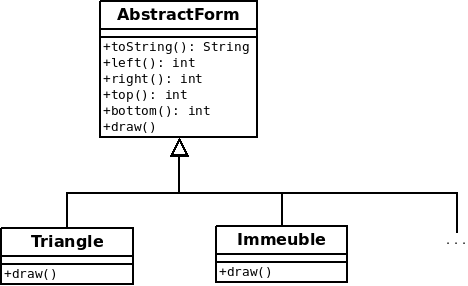
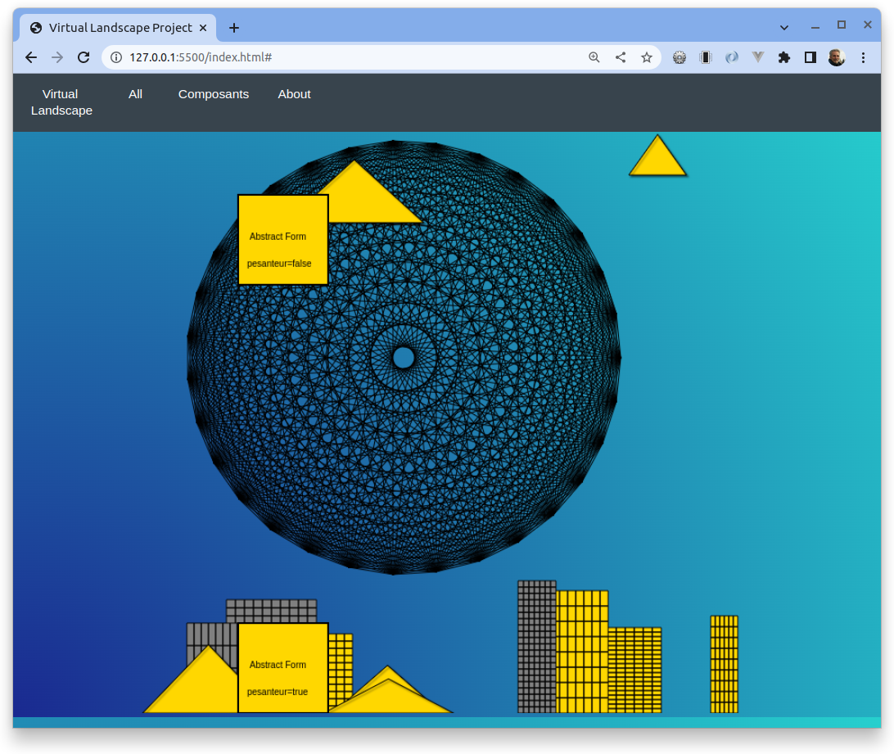
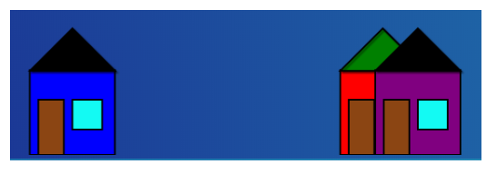
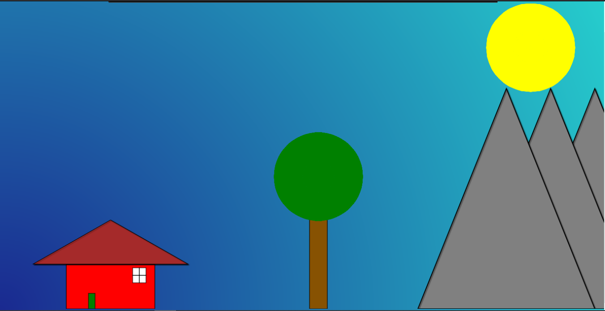
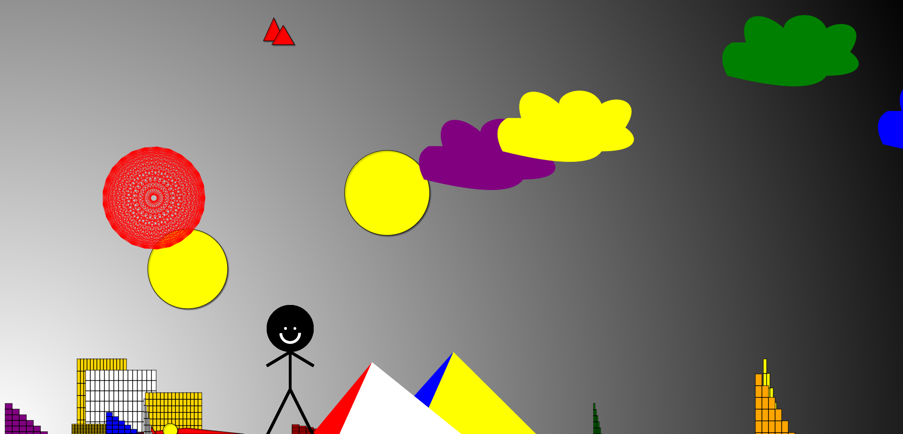
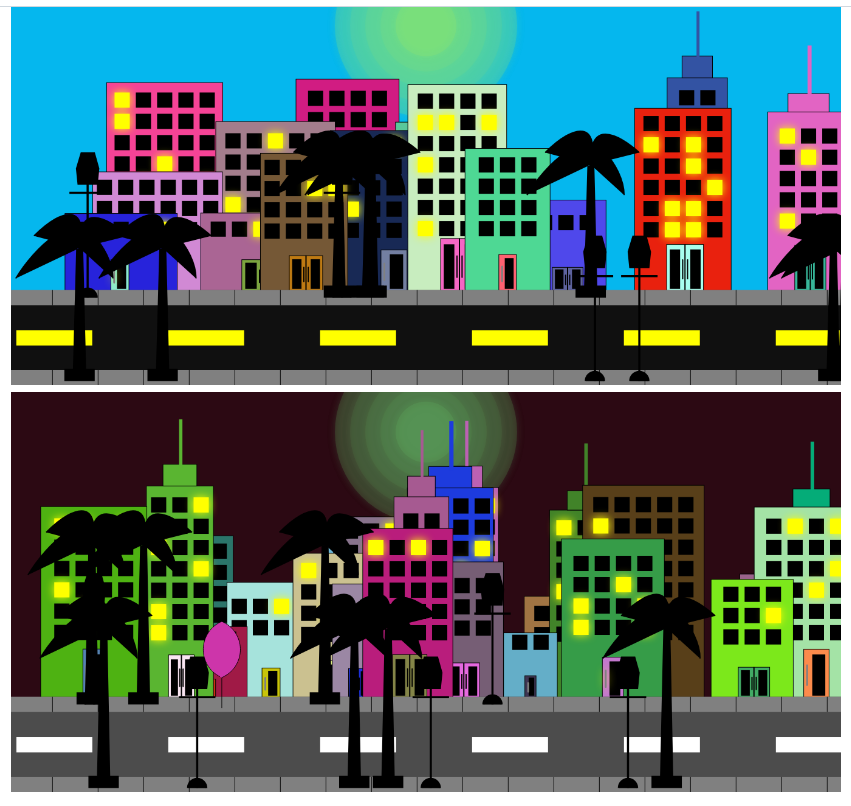
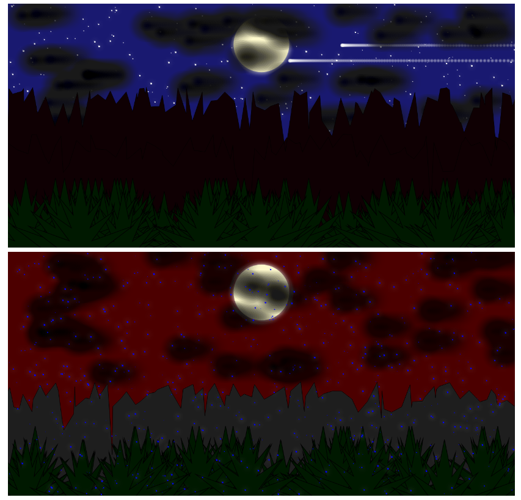
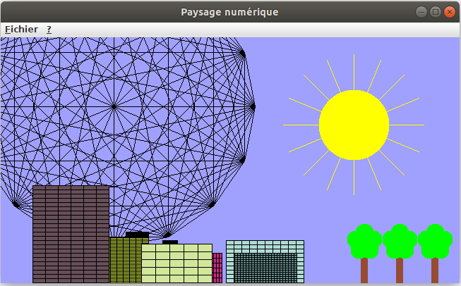

## Générateur de paysages virtuels 

Projet de développement logiciel à destinatation d'apprentis développeur.

Objectifs  

* prise en main d'une petite application javascript (sans framework)
* programmation en javascript dans une approche objet et événementielle
* utilisation de l'API 2D JS intégrée
* développement de la créativité  

### Squelette de l'application

L'application utilse **Vanilla JS framework**. 

La structure des dossiers est simple.


```
.
├── css
│   ├── layout.css
│   └── menu.css
├── docs
│   ├── analyse.dia
│   ├── analyse.png
│   └── ...
├── js
│   ├── main.js
│   └── modules
│       ├── index.js
│       ├── AbstractForm.js
│       ├── Immeuble.js
│       ├── Triangle.js
│       └── ...
├── README.md
└── index.html
```

* `index.html` : Point d'entrée de l'interprétation par un navigateur. Les dépendances de ce fichier sont les feuiiles de styles `css`, et l'inclusion du script `js/main.js`.

* `main.js` : Le chef d'orchestre. Le code qui pilote les actions de dessins. Ce code exploite les classes déclarées dans `js/modules` qui héritent de `AbstractForm`. 

* le dossier `js/modules` contient le code source de classes javascript chargées de dessinner des formes. C'est dans ce dossier que vous placerez vos classes représentant les formes issues de votre imagination. 

* `js/modues/index.js` : Déclare les classes des formes (à mettre à jour lorsque vous définissez une nouvelle classe)
* `js/modues/AbstractForm.js` : c'est la classe de base des formes à venir (des exemples sont fournies)
* `js/modues/Immeuble.js`, `Planete.js`  et `Triangle.js` sont des exemples.

En résumé : Conformément aux exemples fournis, vos nouvelles formes seront représentées par des classes héritant de `AbstractForm.js` et placées dans le dossier `modules`, et déclarées dans `modules/index.js`. 
 
 



### Classe de forme

Une classe qui doit commencer par :

```javascript

import { AbstractForm } from './AbstractForm.js';

/**
 * Déssine un ?????
 */
class ????? extends AbstractForm {
   constructor (
    x = 0,
    y = 0,
    width = 0,
    height = 0,
    fillColor = '',
    strokeColor = '',
    strokeWidth = 2,
    pesenteur = false,
    odreConstruction = 100
  ) {
    super(x,y,width, height, fillColor, strokeColor, strokeWidth, pesenteur, odreConstruction)
  }

 /**
   * Dessine la forme spécifique à cette classe
   * @param ctx contexte 2D du canvas
   */
  draw (ctx) {
    ctx.save()

    // votre code ici

    ctx.restore()
  }

 /**
   * get array of instances of this classe 
   * @return {[Object,...]}
   */
  static buildForms() {
    let forms = []


    // votre code ici


    return forms
  }

```

La méthode `draw` est une **méthode d'instance** qui prend en charge la logique de dessin d'une forme primitive à partir d'un _context 2D_ reçu en paramètre.

La méthode `buildForms` est une **méthode de classe** qui prend en charge la construction d'un motif, composé **d'instances la classe** afin de produire un réultat avec une dose d'aléatoire. Par exemple, construction de plusieurs instances de la classe `Triangle` disposées aléatroirement. Cette méthode retourne un tableau d'instances de la classe.

### Attributs d'une forme (à renseigner lors d'une instanciation)

- `x = 0`  coordonnées en x et y du dessin dans son canvas
- `y = 0`
- `width = 0`   largeur et hauteur de la zone de la forme
- `height = 0`
- `fillColor = ''`   voir fillStyle
- `strokeColor = ''` voir strokeStyle
- `strokeWidth = 2`  largeur des traits
- `pesenteur` : (booléen) si `true`, l'objet sera comme _posé sur le sol_ 
- `ordreConstruction` : (entier) définit si l'objet sera dessiné avant ou après d'autres. (dans les derniers par défaut). Une valeur minimal marque l'objet comme devant être dessiné en premier (comme _Planete_ par exemple), un valeur _maximale_ provoquera l'affichage de l'objet dans les derniers.


## Comment démarrer ?

1. Étudier le tutoriel https://developer.mozilla.org/fr/docs/Tutoriel_canvas/Utilisation_de_base - pour un internet ouvert - Fondation Mozilla open source (https://www.mozilla.org/fr/about/manifesto/)  
2. Étudier le code des exemples dans `js/modules`. Pour les curieux, voir `index.html` et `main.js`.
3. Concevoir, sur le papier, une idée de dessin originale (faire simple pour commencer, et avancer progressivement) - inspirez vous d'exemples glanés sur le net.
4. Créer une nouvelle classe dans `modules` qui traduira votre idée originale en code 
5. Ajouter cette classe à `modules/index.js` et ajouter un nouveau lien dans le dropdown `Composants` de `index.html` (voir ci-après)
5. Mettre au point ... 

<hr>

## Analyse du code existant

### index.html

La commande `Composants`, de la barre de menu, présente les différentes classes des formes présentes dans le dossier `js/modules`. Cette liste est actualisée tout de suite après le chargement de la page (pour les curieux, vous pouvez consulter la fonction `updateListeDesComposants` de `main.js`)

Un clic utilisateur sur un des items de cette liste provoquera un appel à la fonction `drawForm` avec le nom de la classe en argument. Cette fonction appelle la méthode de classe `buildForms` de la classe en question, pour contruire le rendu.

<hr>

## ajouter/supprimer une nouvelle classe de forme
<br>

* Lors d'un ajout d'une nouvelle classe  (par exemple `MaNouvelleFome.js`), redéfinir les méthodes `static buildForms()` et ` draw(ctx)`. Prendre exemple sur `Immeuble`, `Triangle`, `Planete`. Ne pas oublier d'ajouter cette classe en **export** de `js/modues/index.js`.


ATTENTION à bien respecter les conventions de nommage. 
* Le nom des classes doit être de la forme `UpperCamelCase`
* Le nom des méthodes doit être de la forme `LowerCamelCase`
* Une classe est définie dans un fichier de **même nom que le nom de la classe** (avec extension `.js`)

<hr>

### Accessible via un serveur HTTP

Attention, l'application doit être placée derrière en serveur HTTP, et donc accessible à un utilisateur en réponse à une 
requête `HTTP`, commençant par `http://` (et non en protocole `file://`)  

Sous VS, vous pouvez installer l'extension `Live Server`. Une fois installée, vous pouvez faire clic droit sur `index.html` pour lancer une instance d'un serveur HTTP, sur un port particulier, de votre machine locale. Ainsi votre application est-elle prête à être testée. 



<hr>

## Pour info, des exemples (étudiants 2020)

 

 

 
 
 

 
 
 

<hr>

## Un historique en java (étudiant) 

<br>

 

[Exemple d'un projet d'étudiant - code et executable en java](docs/java-genPaysageEtudiant.zip) 

Une fois décompressé :

`=> lancement   : java -jar paysage.jar`

`=> son rapport : ./genPaysage/rapport/`

`=> le code source : ./genPaysage/*`

<hr>

## Ressources externes

- Comprendre le `canvas` : https://developer.mozilla.org/fr/docs/Web/API/Canvas_API/Tutorial/Basic_usage


- (autre ressource) Dessiner dans un canvas : https://www.w3schools.com/graphics/canvas_drawing.asp


- Si vous souhaitez ajouter à l'application la possibilité de sauvegarder le rendu d'un canvas, à un instant _t_  :  Comment télécharger l'image d'un canvas en js : https://nosmoking.developpez.com/demos/js/canvas-download.html

